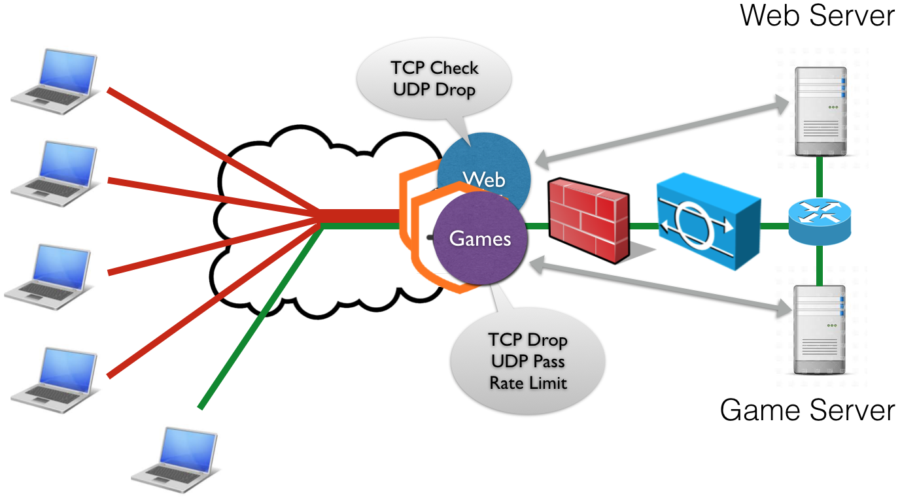
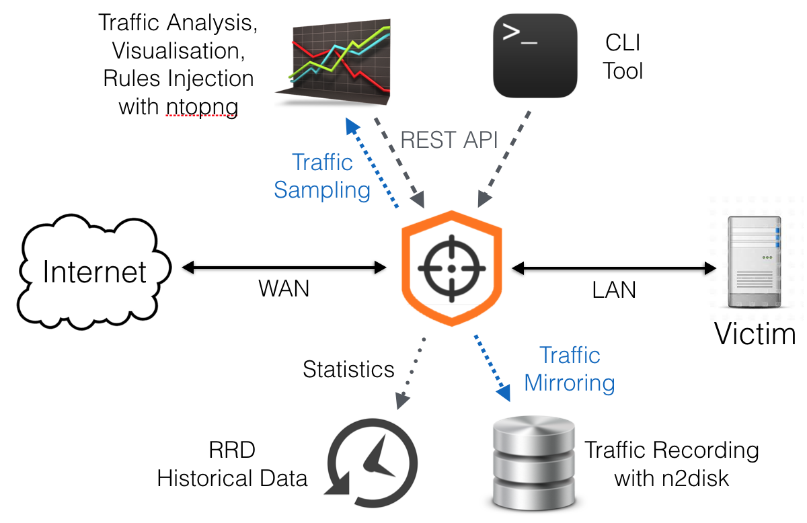

Main Features
=============

Traffic enforcement
-------------------

- TCP sessions validation
- Dynamic whitelisting with expiration on successful session check
- User-defined whitelist/blacklist/graylist of source subnets with CIDR notation
- ACL-like accept/drop policies based on UDP/TCP port, ICMP type, etc.
- Other drop policies based on IP TTL values, UDP payload size, fragments, etc. 
- DNS SLIP-like checks: force TCP, etc.
- Mitigation UDP-based amplification attacks.
- Signature-based filtering (offset and string)
- HTTP filtering, based on request items name/content.
- Traffic Throttling: packets below the threshold are forwarded, otherwise they are discarded. This guarantee that unwanted traffic will have an egress rate capped to a specific value. Ability to specify the rate based on protocol and source or destination.
- Traffic checkers are implemented as plugins with a clean API, so that more checkers for specific protocols can be created.

Multi-Tenancy
-------------

- Ingress traffic is split towards several virtual mitigators, based on the destination IP address, this way it is possible to specify traffic enforcement policies per destination subnet
- Each virtual mitigator is bound to traffic enforcement profiles: default, white, black, gray. Each profile contains a traffic enforcement configuration (e.g. SYN check=yes, ICMP Drop=No) and applies to source IPs according to the lists (white/black/gray).
- Global or per-destination bypass mode

Traffic Visibility
------------------

- Statistics dump to RRD for keeping an history of traffic trends.
- Ability to send sampled/full good/bad/all traffic to external virtual devices (e.g. for traffic analysis or dump).

Hw acceleration and Scalability
-------------------------------

- Hardware bypass NIC support (Silicom): ensures that nScrub will have no impact in the infrastructure in case of hardware failure.
- Load balancing across cores using hw RSS or custom sw distribution

UI
--

- REST API for reconfiguring the engine on-the-fly
- CLI tool with auto-completion

