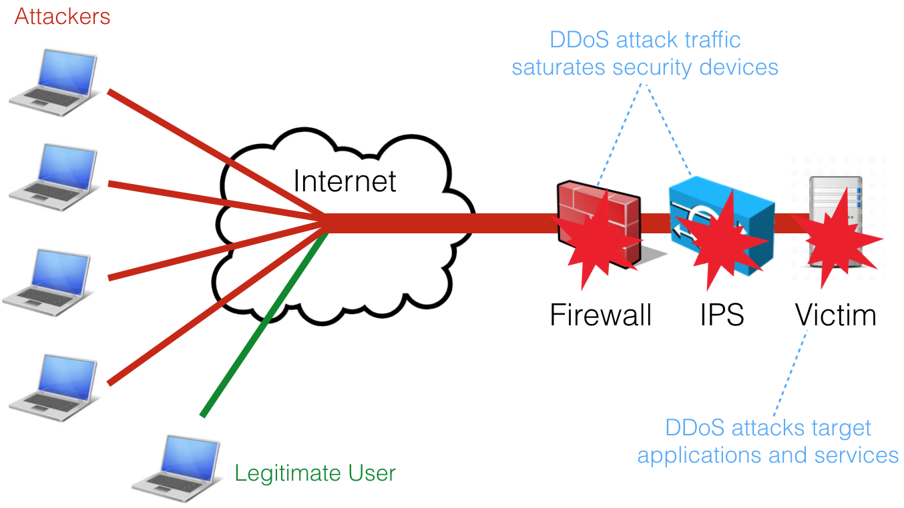

nScrub Documentation
====================

nScrub is a DDoS mitigation system based on PF_RING ZC, able to operate at 10 Gigabit/s line-rate using a low-end system, and scale to Terabit/s building a modular architecture.

A DDoS (Distributed Denial of Service) attack is an attempt to make a service unavailable by overwhelming it with malicious traffic from multiple distributed sources. 

Common routers, firewalls and IPSs are not designed to handle high volume of packets per second and are often the the first victim of the Denial of Service attacks. Specialised solutions are needed to protect the infrastructure, solutions that can not only route or bridge high packet rates but also able to filter and challenge malicious traffic. 

Such dedicated solutions in the past where implemented by dedicated hardware with specially designed ASICs or FPGAs capable of handling high speed filtering.

nScrub is a software-based DDoS mitigation tool based on PF_RING and Zero Copy able to operate at 10 Gbps line rate (no matter the packet size) using commodity hardware (e.g. Intel NICs and standard servers). 

nScrub is easy to configure, even for beginners and companies that never faced with DDoS until now. Affordable in terms of price, deployment, reporting. A looking glass to see the status of the network while mitigating attacks.

nScrub not only performs as good as a hardware based solution but provide a flexibility that makes it unique:

- Easy Deployment: nScrub can be implemented as bump in the wire (i.e. no BGP or traffic tunnelling necessary to deploy nScrub).
- Low Cost: very low TCO (Total Cost of Ownership).
- Modularity: extensibility for the definition of additional algorithms for traffic mitigation. They can be implemented through an API that allows developers to create their own mitigation facilities to be used in addition to those part of nScrub.
- Rich Detection: precise mitigation based on algorithms that try to determine whether the incoming traffic is real/legitimate.
- Auto-healing: automatic escalation during mitigation: when things get bad, the user has the ability to enable auto-escalation to put in place a proper reaction to threats.
- No hardware locking: nScrub can operate with multiple hardware vendors avoiding vendor locking.

The main features include:

- Support for asymmetric (i.e. ability to mitigate only one traffic direction, from Internet to the protected network) and symmetric (i.e. mitigate from Internet to the protected network, but also forward the outbound traffic) mode. Asymmetric mode allows also to deploy nScrub as a off-ramp solution (scrubbing center) by means of BGP re-routing. 
- Detection of real/legitimate traffic by means of techniques that try to detect if the sender is real or not and the session is legitimate or not.
- Ability to monitor/visualise legitimate/good ingress traffic as well as discarded/bad traffic, both sampled or not, forwarding traffic to egress interfaces to be sent to monitoring machines  or IDS (e.g. snort), or to be recorded and analysed at later stage.
- Ability to configure mitigation profiles per destinations (i.e. the network to protect) so that each host of the protected network can have a custom protection policy.
- Multi protocol application support including DNS, HTTP and HTTPS

.. toctree::
   :caption: User's Guide

   features
   install
   versions
   engine_conf
   working_modes
   tuning
   traffic_enforcement_conf
   monitoring
   cli
   testing
   hw_bypass

.. toctree::
   :caption: Other Products

   ntopng <https://www.ntop.org/guides/ntopng/>
   nProbe <https://www.ntop.org/guides/nprobe/>
   nProbe Cento <https://www.ntop.org/guides/cento/>
   n2disk <https://www.ntop.org/guides/n2disk/>
   nDPI <https://www.ntop.org/guides/nDPI/>
   PF_RING <https://www.ntop.org/guides/pf_ring/>
   nEdge <https://www.ntop.org/guides/nedge/>
   nScrub <https://www.ntop.org/guides/nscrub/>
   nBox <https://www.ntop.org/guides/nbox/>
   nTap <https://www.ntop.org/guides/ntap/>
   
.. Indices and tables
.. ==================
.. 
.. * :ref:`genindex`
.. * :ref:`modindex`
.. * :ref:`search`

