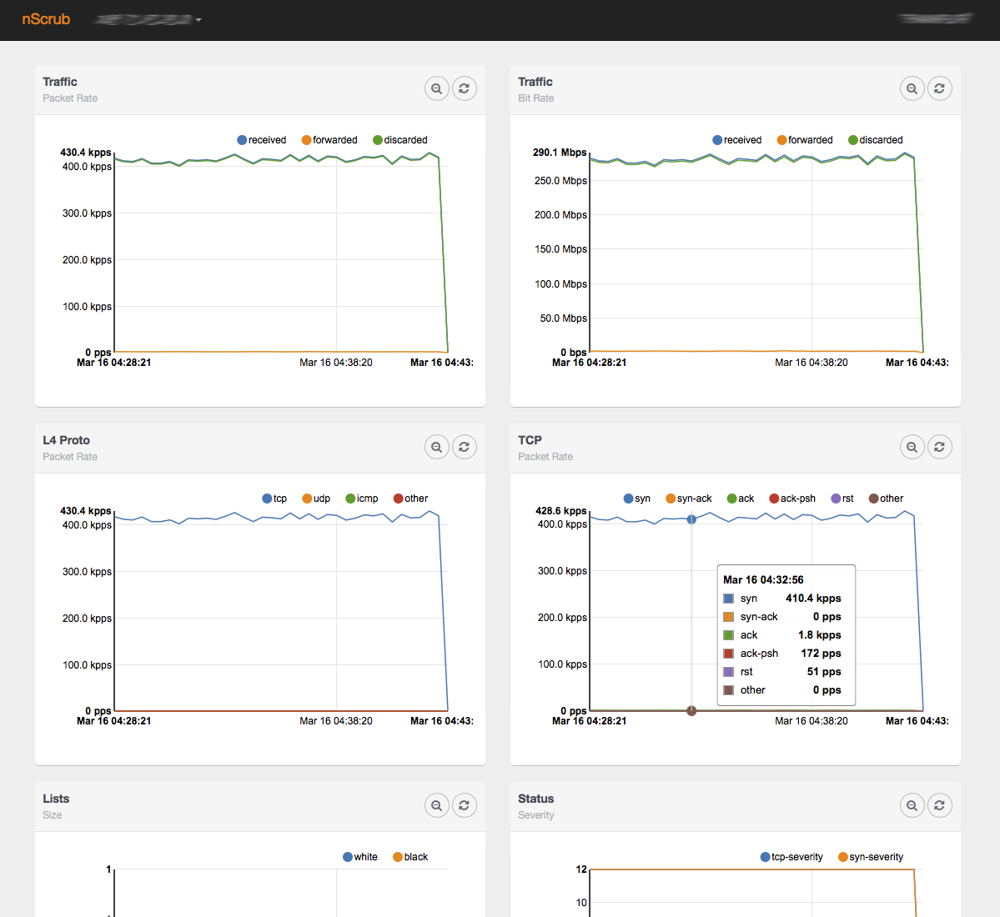

Traffic Visibility
==================

This section shows the options for having visibility of the traffic under mitigation.

Statistics
----------

The application provides global and per-victim statistics.

Global statistics are available through the logs:

.. code-block:: console

   tail -f  /var/tmp/nscrub.log

or through the REST API:

.. code-block:: console

   curl -u <user>:<password> "http://<host>:<port>/stats"

Per-victim stats are available through the REST API:

.. code-block:: console

   curl -u <user>:<password> "http://<host>:<port>/targets?action=stats&target_id=<target id>"

Historical statistics from RRDs, both global and per-victim, are also available using a browser connecting to *http://<host>:<port>/monitor.html*

.. note:: nScrub listens on localhost by default, please configure a different address (-G option) to connect using a browser on a remote machine.

Traffic Monitoring
------------------

The software has the ability to export some traffic to software queues for attaching external applications, for traffic analysis or recording:

In order to enable auxiliary software queues for traffic monitoring, the --aux-queues|-O option has to be added to the nScrub configuration file, specifying the number of queues to allocate, which matches the maximum number of concurrent application that will monitor the traffic (queues are single consumer).

.. code-block:: text

   --aux-queues 1

Please note that in order to avoid locking mechanisms, a queue per thread is created (we call it “queue set”), for each consumer application.

Once auxiliary queues have been enabled, it is possible to configure them for exporting sampled (or all) traffic (good, discarded, or all) to external applications through the API: 

.. code-block:: console

   curl -u <user>:<password> "http://<host>:<port>/mirror/<queue set id>/type[?action=update&value={forwarded, discarded, injected, all}]"
   curl -u <user>:<password> "http://<host>:<port>/mirror/<queue set id>/direction[?action=update&value={wan, lan, any}]"
   curl -u <user>:<password> "http://<host>:<port>/mirror/<queue set id>/sampling[?action=update&value=<sampling rate (0 for no traffic)>]"

The *type* parameter configures which traffic type to mirror:

- **forwarded**: Only forwarded/passed packets
- **discarded**: Only dropped packets
- **injected**: Only injected packets (e.g., SYN cookies, RST responses)
- **all**: All traffic (default)

The *direction* parameter configures which traffic direction to mirror:

- **wan**: Only packets arriving from the WAN interface
- **lan**: Only packets arriving from the LAN interface
- **any**: Packets from both interfaces (default)

The *sampling* parameter sets the sampling rate (mirror every Nth packet).

Example:

.. code-block:: console

   curl -u <user>:<password> "http://<host>:<port>/mirror/0/type?action=update&value=all"
   curl -u <user>:<password> "http://<host>:<port>/mirror/0/direction?action=update&value=wan"
   curl -u <user>:<password> "http://<host>:<port>/mirror/0/sampling?action=update&value=100"

Using the CLI tool:

.. code-block:: console

   nscrub-cli
   localhost:8880> mirror 0 type all
   localhost:8880> mirror 0 direction wan
   localhost:8880> mirror 0 sampling 100

Traffic Analysis with tcpdump
~~~~~~~~~~~~~~~~~~~~~~~~~~~~~

It is possible for instance to use tcpdump for monitoring the traffic running one instance per processing thread, specifying the cluster ID and thread/queue ID in the interface name:

.. code-block:: console

   tcpdump -Q in -ni zc:99@0
   tcpdump -Q in -ni zc:99@1
   tcpdump -Q in -ni zc:99@2
   tcpdump -Q in -ni zc:99@3

Alternatively, it is possible to aggregate all traffic to a single queue and run a single tcpdump instance:

.. code-block:: console

   zbalance_ipc -i zc:99@0,zc:99@1,zc:99@2,zc:99@3 -c 100 -n 1
   tcpdump -Q in -ni zc:100@0

Traffic Analysis with ntopng
~~~~~~~~~~~~~~~~~~~~~~~~~~~~

In the same way it is possible to analyse the traffic using ntopng:

.. code-block:: console

   ntopng -i zc:99@0 -i zc:99@1 -i zc:99@2 -i zc:99@3

This creates 4 interfaces in ntopng, however it is possible to aggregate all of them in a single view
to be able to analyse aggregated traffic from all of them:

.. code-block:: console

   ntopng -i zc:99@0 -i zc:99@1 -i zc:99@2 -i zc:99@3 -i view:zc:99@0,zc:99@1,zc:99@2,zc:99@3

Events
------

nScrub can export events as soon as an abnormal behaviour is detected, for instance a threshold
has been crossed or one of the automatic detection algorithms engate a protection mechanism.
Events can be exported (logged, or sent by mail or other endpoints) by means of scripts.
nScrub already includes sample scripts under /usr/share/nscrub/scripts/callbacks/events, they
can be customized and enabled by making them executable (chmod +x <script>). Additional custom
scripts can be created and enabled by placing them in the same folder and making them executable.
A JSON string representing the event is provided to the script in the standard input. The event
format is described in the table below.

+------------+------------+-----------------------------------------+ 
| Name       | Type       | Description                             |
+============+============+=========================================+ 
| uniqid     | int64      | Unique event ID                         |
+------------+------------+-----------------------------------------+ 
| id         | int        | Event number since startup              |
+------------+------------+-----------------------------------------+ 
| target_id  | int        | Target ID                               |
+------------+------------+-----------------------------------------+ 
| status     | string     | new, continuation or terminated         |
+------------+------------+-----------------------------------------+ 
| type       | int        | Event type                              |
+------------+------------+-----------------------------------------+ 
| reason     | int        | Event reason                            |
+------------+------------+-----------------------------------------+ 
| epoch      | int        | Epoch                                   |
+------------+------------+-----------------------------------------+ 
| time       | string     | Time (human readable)                   |
+------------+------------+-----------------------------------------+ 
| duration   | int        | Event duration                          |
+------------+------------+-----------------------------------------+ 
| thread     | string     | Internal thread that detected the event |
+------------+------------+-----------------------------------------+ 

Example for enabling the "logger" script which logs events under /var/tmp/nscrub/events.log

.. code-block:: console

   chmod +x /usr/share/nscrub/scripts/callbacks/events/logger.sh

