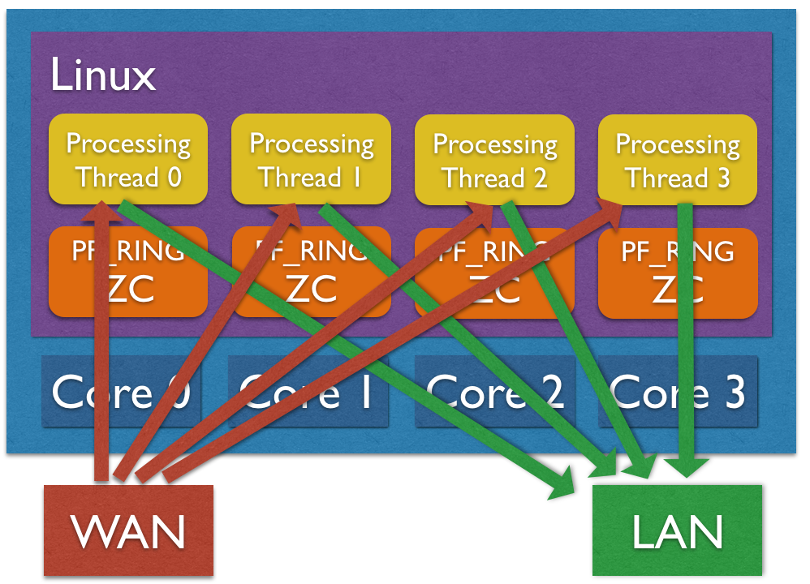
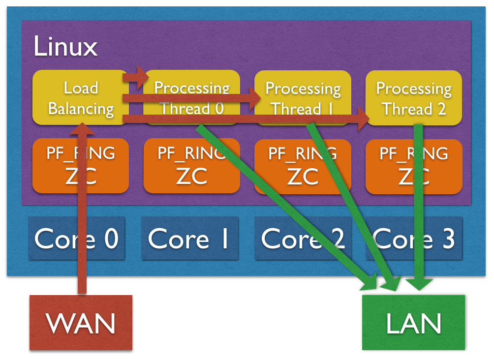

Performance and Tuning
======================

This section covers a few key aspects for running the application at line-rate.

Hardware Configuration
----------------------

First of all you should figure out what is the actual hardware configuration. Please make sure that:

1. Memory is properly installed. 

Please check on ark.intel.com the number of memory channels supported by your CPU, and make sure there is a memory module installed for each channel. If you do not have physical access to the machine, or you just want to double-check everything is properly configured, you can use dmidecode. In the example below the machine has 4 memory channels, and there is a memory module installed for each channel.

.. code-block:: console

   dmidecode | grep "Configured Clock Speed"
   	Configured Clock Speed: 1600 MHz
   	Configured Clock Speed: 1600 MHz
   	Configured Clock Speed: 1600 MHz
   	Configured Clock Speed: 1600 MHz

2. NICs are properly installed. 

Please check the cards you are using are installed on PCIe slots with enough lanes and speed for supporting the bandwidth you expect. You can check this from dmesg, or doing some math using the PCIe speed based on version and the number of lanes reported on the motherboard.

.. code-block:: console

   dmesg | grep Speed
   [    3.075885] ixgbe 0000:01:00.0: (Speed:5.0GT/s, Width: x8, Encoding Loss:20%)
   [    3.314675] ixgbe 0000:01:00.1: (Speed:5.0GT/s, Width: x8, Encoding Loss:20%)

In case of NUMA systems (i.e. multiple CPUs), please make sure the card is installed on the right PCIe slot, directly connected to the CPU you are going to use for traffic processing. You can use lstopo for this. In the example below there are 2 NICs, one is installed on NUMA node 0 (eth0 and eth1) and one is installed on NUMA node 1 (eth1 and eth2).

.. code-block:: console

   lstopo
   Machine (63GB)
     NUMANode L#0 (P#0 31GB)
       Socket L#0 + L3 L#0 (20MB)
         L2 L#0 (256KB) + L1d L#0 (32KB) + L1i L#0 (32KB) + Core L#0
           PU L#0 (P#0)
           PU L#1 (P#16)
         L2 L#1 (256KB) + L1d L#1 (32KB) + L1i L#1 (32KB) + Core L#1
           PU L#2 (P#2)
           PU L#3 (P#18)
         L2 L#2 (256KB) + L1d L#2 (32KB) + L1i L#2 (32KB) + Core L#2
           PU L#4 (P#4)
           PU L#5 (P#20)
         L2 L#3 (256KB) + L1d L#3 (32KB) + L1i L#3 (32KB) + Core L#3
           PU L#6 (P#6)
           PU L#7 (P#22)
         L2 L#4 (256KB) + L1d L#4 (32KB) + L1i L#4 (32KB) + Core L#4
           PU L#8 (P#8)
           PU L#9 (P#24)
         L2 L#5 (256KB) + L1d L#5 (32KB) + L1i L#5 (32KB) + Core L#5
           PU L#10 (P#10)
           PU L#11 (P#26)
         L2 L#6 (256KB) + L1d L#6 (32KB) + L1i L#6 (32KB) + Core L#6
           PU L#12 (P#12)
           PU L#13 (P#28)
         L2 L#7 (256KB) + L1d L#7 (32KB) + L1i L#7 (32KB) + Core L#7
           PU L#14 (P#14)
           PU L#15 (P#30)
       HostBridge L#0
         PCIBridge
           PCI 8086:154d
             Net L#1 "eth0"
           PCI 8086:154d
             Net L#2 "eth1"
     NUMANode L#1 (P#1 31GB)
       Socket L#1 + L3 L#1 (20MB)
         L2 L#8 (256KB) + L1d L#8 (32KB) + L1i L#8 (32KB) + Core L#8
           PU L#16 (P#1)
           PU L#17 (P#17)
         L2 L#9 (256KB) + L1d L#9 (32KB) + L1i L#9 (32KB) + Core L#9
           PU L#18 (P#3)
           PU L#19 (P#19)
         L2 L#10 (256KB) + L1d L#10 (32KB) + L1i L#10 (32KB) + Core L#10
           PU L#20 (P#5)
           PU L#21 (P#21)
         L2 L#11 (256KB) + L1d L#11 (32KB) + L1i L#11 (32KB) + Core L#11
           PU L#22 (P#7)
           PU L#23 (P#23)
         L2 L#12 (256KB) + L1d L#12 (32KB) + L1i L#12 (32KB) + Core L#12
           PU L#24 (P#9)
           PU L#25 (P#25)
         L2 L#13 (256KB) + L1d L#13 (32KB) + L1i L#13 (32KB) + Core L#13
           PU L#26 (P#11)
           PU L#27 (P#27)
         L2 L#14 (256KB) + L1d L#14 (32KB) + L1i L#14 (32KB) + Core L#14
           PU L#28 (P#13)
           PU L#29 (P#29)
         L2 L#15 (256KB) + L1d L#15 (32KB) + L1i L#15 (32KB) + Core L#15
           PU L#30 (P#15)
           PU L#31 (P#31)
       HostBridge L#8
         PCIBridge
           PCI 8086:154d
             Net L#7 "eth2"
           PCI 8086:154d
             Net L#8 "eth3"

In case of NUMA system it is important to tell the driver what is the CPU we are going to use for packet processing for each network interface, in order to setup resources in the right place in memory and improve memory locality. In order to do this, please refer to the Installation - PF_RING section where we configured the driver using:

.. code-block:: console

   echo "RSS=0,0" > /etc/pf_ring/zc/ixgbe/ixgbe.conf

In order to specify the CPU affinity it is possible to use the numa_cpu_affinity parameter, passing core IDs for memory allocation, one per interface (4 interfaces in this example):

.. code-block:: console

   echo "RSS=0,0,0,0 numa_cpu_affinity=0,0,8,8” > /etc/pf_ring/zc/ixgbe/ixgbe.conf

Where 0 is a core ID on the first CPU, 8 is a core ID on the second CPU.

Please remember to reload PF_RING using the init.d script after changing the configuration.

Load Balancing
--------------

Load balancing is important for distributing workload across multiple CPU cores. The application supports traffic distribution using hardware RSS support or using zero-copy software distribution based on ZC.

Hardware Traffic Distribution (RSS)
~~~~~~~~~~~~~~~~~~~~~~~~~~~~~~~~~~~

By default the application expects that hw RSS has been configured, spawning as many processing threads as the number of RSS queues. In the Installation - PF_RING section we configured the driver with the “auto” RSS mode (as many RSS queues as the number of CPU cores) using:

.. code-block:: console

   echo "RSS=0,0" > /etc/pf_ring/zc/ixgbe/ixgbe.conf

It is also possible to specify the number or queues, passing the number of queues per interface (2 interfaces, 4 queues per interface in this example) to the RSS parameter:

.. code-block:: console

   echo "RSS=4,4" > /etc/pf_ring/zc/ixgbe/ixgbe.conf

Please remember to reload PF_RING using the init.d script after changing the configuration.

It is possible to check the current number of RSS queues for each interface from the informations reported by PF_RING under /proc:

.. code-block:: console

   cat /proc/net/pf_ring/dev/eth1/info | grep Queues
   Max # TX Queues:   4
   # Used RX Queues:  4

Software Traffic Distribution (ZC)
~~~~~~~~~~~~~~~~~~~~~~~~~~~~~~~~~~

Another option for distributing traffic across cores is using zero-copy software distribution based on ZC. This mode provides more flexibility in traffic distribution as hash is computed in software and it can be applied to any packet header or payload. Please note RSS is still needed for lock-free zero-copy transmission as depicted in the picture below.
In order to enable software distribution the --sw-distribution|-w option should be specified into the nscrub configuration file.

CPU Affinity
------------

CPU affinity is very important for equally distributing the load across cores. There are a few options for setting the core affinity for each thread used by the application.

Time-Source Thread
~~~~~~~~~~~~~~~~~~

In order to have a precise low-cost time source, a dedicated thread is used. It is possible to bind this thread to a core using the *--time-source-affinity|-T* option.

Processing Threads
~~~~~~~~~~~~~~~~~~

Using the load balancing support, both hardware RSS or software distribution, a processing thread is spawned for each RSS queues. It is possible to bind each thread to a core by listing core IDs in the nscrub configuration file using the --thread-affinity|-g option (colon-separated list). Example (4 RSS queues):

.. code-block:: console

   cat /etc/nscrub/nscrub.conf 
   --wan-interface=zc:eth1
   --lan-interface=zc:eth2
   --time-source-affinity=0
   --thread-affinity=1:2:3:4
   --log-path=/var/tmp/nscrub.log
   --pid-path=/var/tmp/nscrub.pid
   --daemon

Load Balancer Thread (Software Traffic Distribution only)
~~~~~~~~~~~~~~~~~~~~~~~~~~~~~~~~~~~~~~~~~~~~~~~~~~~~~~~~~

Using software distribution (--sw-distribution|-w) in place of hw RSS, an additional balancer thread is used for computing the packet hash and steer the packet to the right processing thread. It is possible to set the core affinity for this thread using the --balancer-affinity|-r option. Example:

.. code-block:: console

   cat /etc/nscrub/nscrub.conf 
   --wan-interface=zc:eth1
   --lan-interface=zc:eth2
   --time-source-affinity=0
   --balancer-affinity=1
   --thread-affinity=2:3:4:5
   --log-path=/var/tmp/nscrub.log
   --pid-path=/var/tmp/nscrub.pid
   --daemon

Zero-Copy TX and TX Offload
---------------------------

Packet forwarding in nscrub requires a packet to be received, processed and transmitted.
On Intel ZC interfaces transmission is implemented by swapping a pointer, without a packet copy.
On other adapters a full packet copy is usually involved, with performance degradation.

Napatech adapters instead support zero-copy transmission, this means received packets can be forwarded
in hardware, offloading the packet copy, by setting a special flag in the received packet descriptor.
This support should be enabled when configuring the adapter, by using the ntpl tool, and can be combined
with streams to distribute the load to multiple cores.

Please find below a sample script that can be used to configure 4 streams on port 0, and 4 streams on
port 1, and forward traffic from the receive streams to the opposite port by using a descriptor flag.

.. code-block:: bash

   #!/bin/bash
   
   /opt/napatech3/bin/ntpl -e "Delete=All"
   /opt/napatech3/bin/ntpl -e "HashMode[Priority = 0; Layer4Type=TCP,UDP,SCTP] = Hash5TupleSorted"
   /opt/napatech3/bin/ntpl -e "HashMode[Priority = 1; Layer3Type=IP] = Hash2TupleSorted"
   /opt/napatech3/bin/ntpl -e "Setup[NUMANode=0] = StreamId==(0..7)"
   /opt/napatech3/bin/ntpl -e "Setup[TxDescriptor = Dyn; TxPorts = 1; TxIgnorePos = 42] = StreamId == (0..3)"
   /opt/napatech3/bin/ntpl -e "Setup[TxDescriptor = Dyn; TxPorts = 0; TxIgnorePos = 42] = StreamId == (4..7)"
   /opt/napatech3/bin/ntpl -e "Assign[StreamId = (0..3); Descriptor=Dyn3] = Port == 0"
   /opt/napatech3/bin/ntpl -e "Assign[StreamId = (4..7); Descriptor=Dyn3] = Port == 1"

In order to enable TX offload in nScrub, a :code:`--tx-offload` option is available. In the below sample
configuration file, nScrub is configured to spaws 4 capture threads, one per stream, and forward traffic 
using the TX offload.

.. code-block:: text

   --lan-interface=nt:stream0,nt:stream1,nt:stream2,nt:stream3
   --lan-tx-interface=nt:1,nt:1,nt:1,nt:1
   
   --wan-interface=nt:stream4,nt:stream5,nt:stream6,nt:stream7
   --wan-tx-interface=nt:0,nt:0,nt:0,nt:0
   
   --tx-offload

