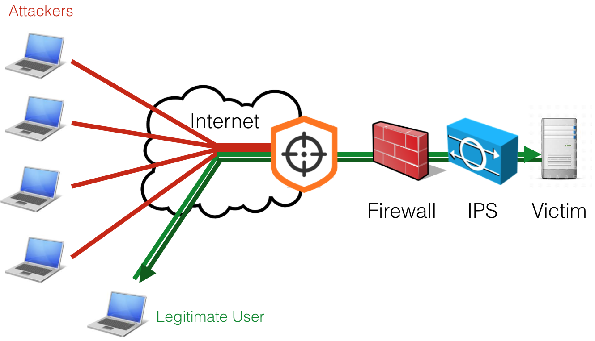
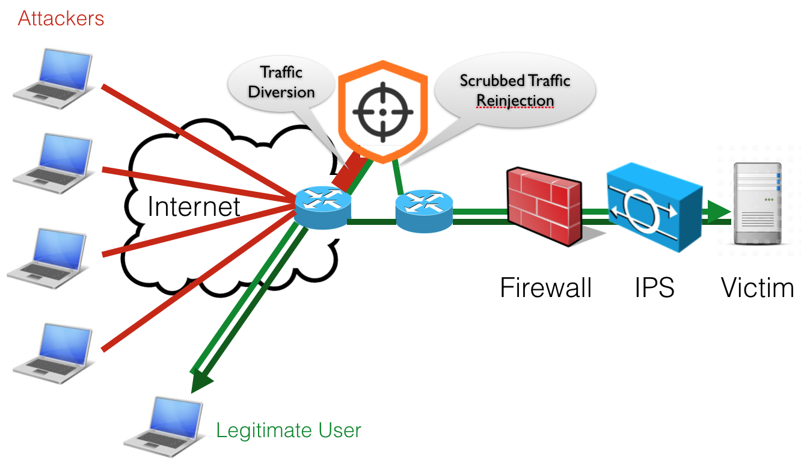

Working Modes
=============

The software can run in transparent bridge or routing mode, in symmetric or asymmetric mode.

Transparent Bridge Mode
-----------------------

When running the software as transparent bridge (default), an interface pair must be specified for traffic bridging. This mode can work both in bidirectional mode, inspecting traffic in both directions, or in asymmetric mode, specifying the *--asymmetric-routing|-A* option (inbound only), when used for instance with traffic diversion techniques.

Configuration file example:

.. code-block:: text

   --lan-interface=zc:eth1
   --wan-interface=zc:eth2

Routing Mode
------------

When running the software in routing mode (specifying the *—routing|-x* option), one or two interfaces can be used. Also in this configuration both symmetric and asymmetric mode can be used. In this mode an IP address on the LAN interface should be configured by using the standard OS configuration (e.g. linux network manager). The configured IP address should be used as gateway / next hop. The routing table must be also configured, using the nscrub API or the CLI tool. In order to learn how to use the API read the *Traffic Enforcement Configuration* section and the API documentation.

Configuration file example (2 interfaces):

.. code-block:: text

   --lan-interface=zc:eth1
   --wan-interface=zc:eth2
   --routing

